# Diagramas para seleccionar una prueba estadística

#### Complemento Codex — Estadística inferencial y planes experimentales

Estos diagramas amplían el esquema utilizado en Psicología. Incluyen las ramas marcadas con una cruz en el documento original, ya que las cruces indicaban únicamente que esos contenidos ya habían sido evaluados en L2.

El conjunto cubre los principales tests estudiados en estadística inferencial, Psicología y Data Science. Se ha dividido en varios diagramas para que las decisiones sigan siendo legibles.

> Para importarlos en draw.io: copia solamente el contenido de un bloque `mermaid` y utiliza **Insertar → Avanzado → Mermaid**.

---

## 1. Puerta de entrada: ¿qué quieres analizar?

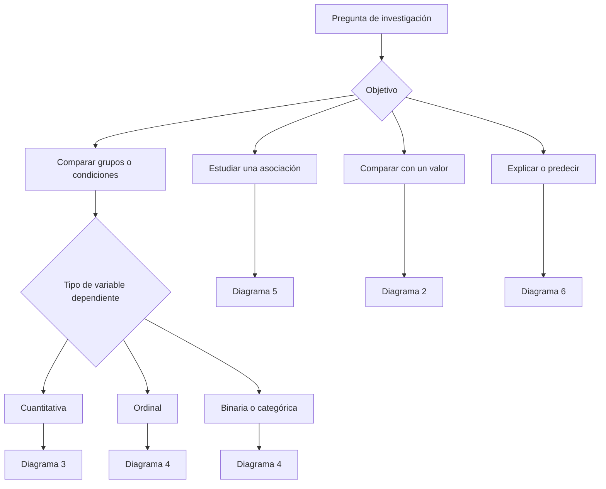

---

## 2. Una muestra comparada con un valor de referencia

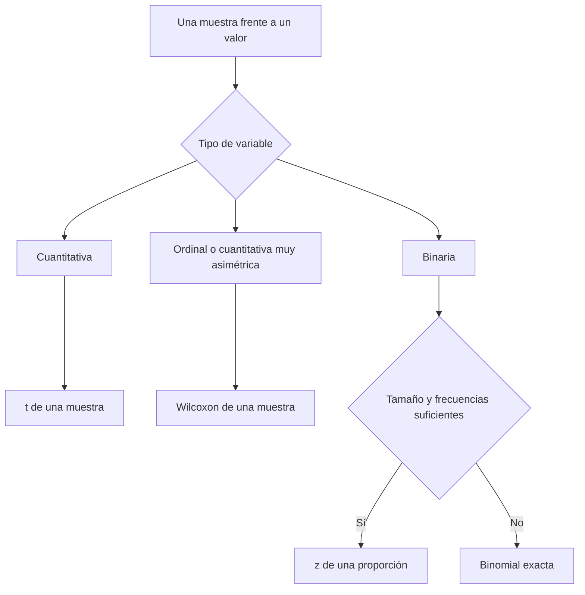

Hipótesis típicas para una media:

- bilateral: $H_0:\mu=\mu_0$ frente a $H_1:\mu\neq\mu_0$;
- unilateral superior: $H_0:\mu\leq\mu_0$ frente a $H_1:\mu>\mu_0$;
- unilateral inferior: $H_0:\mu\geq\mu_0$ frente a $H_1:\mu<\mu_0$.

---

## 3. VD cuantitativa: comparación de grupos o condiciones

Este es el desarrollo completo del diagrama de planes experimentales de Psicología.

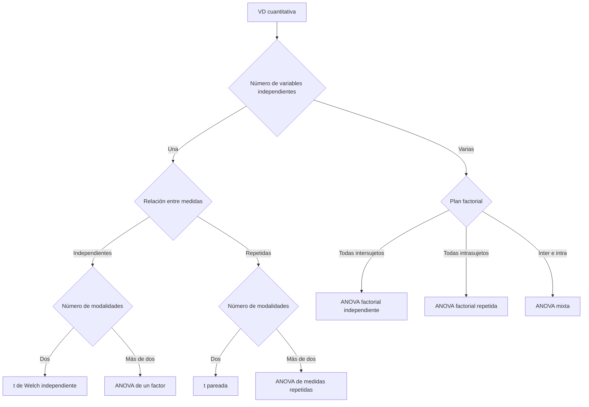

### Alternativas y extensiones para la VD cuantitativa

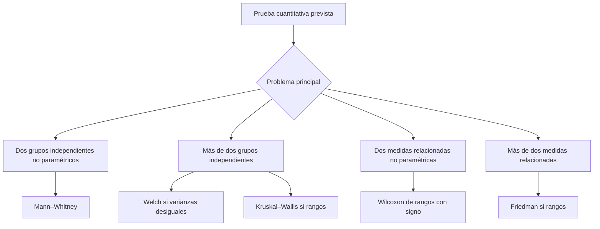

### Casos adicionales

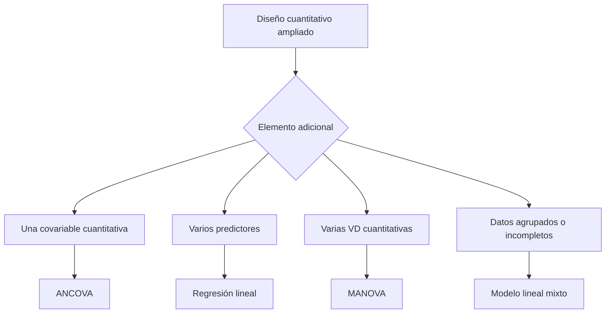

#### Notas de selección

- Se recomienda **Welch** para dos grupos independientes porque no exige igualdad de varianzas.
- Para más de dos grupos independientes, una ANOVA de Welch sustituye a la ANOVA clásica cuando las varianzas son claramente diferentes.
- Mann–Whitney, Wilcoxon, Kruskal–Wallis y Friedman trabajan con rangos; no son simplemente tests de igualdad de medias.
- Un modelo lineal mixto es especialmente útil con medidas repetidas desiguales, datos faltantes o participantes agrupados en aulas, centros u hospitales.

---

## 4. VD ordinal, binaria o categórica

### 4.1. Variable ordinal

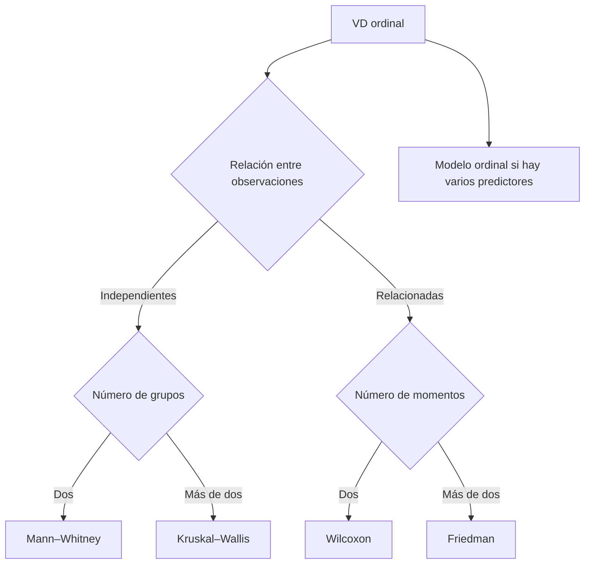

### 4.2. Variable binaria o categórica

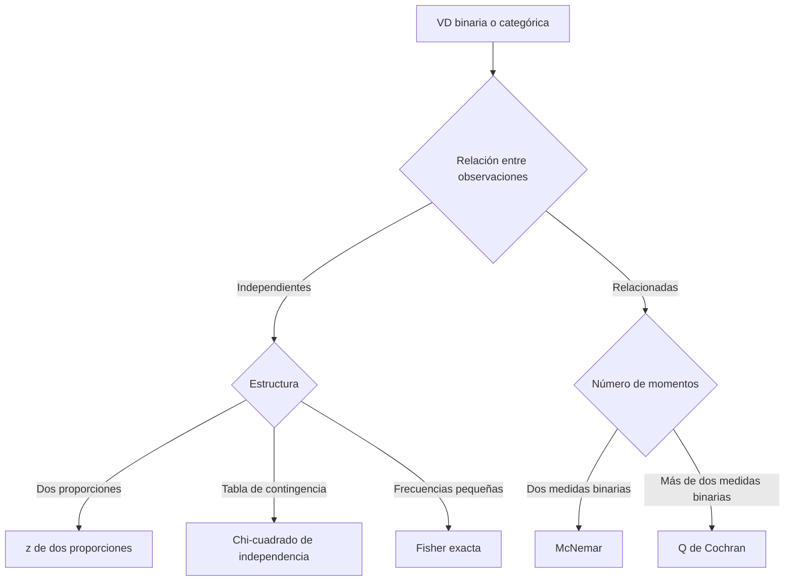

### Modelos para varias variables explicativas

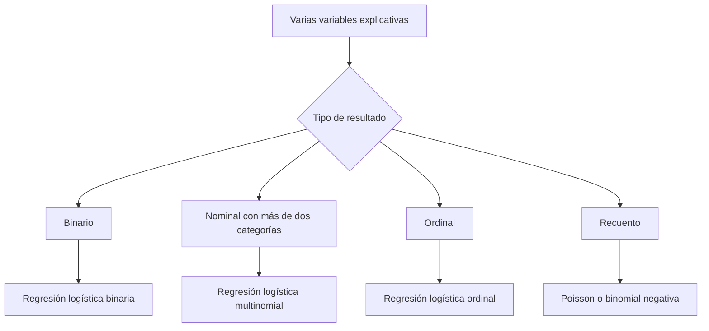

#### Nota sobre chi-cuadrado y Fisher

La elección no depende únicamente de que la muestra total sea mayor que 30. Hay que examinar las **frecuencias esperadas dentro de las celdas**. Fisher es especialmente útil en tablas 2 × 2 con frecuencias pequeñas.

---

## 5. Asociación entre variables

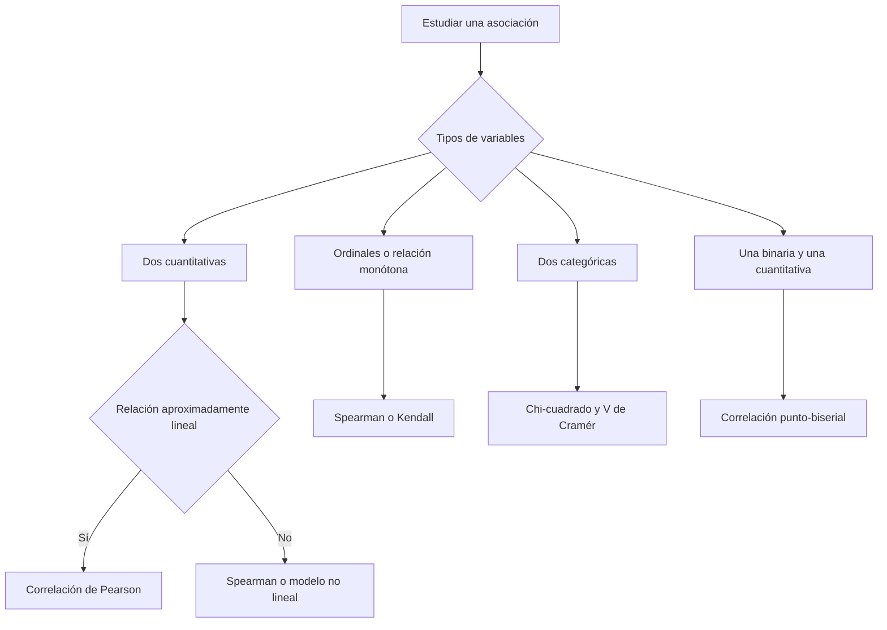

#### Punto de vigilancia

La correlación no demuestra causalidad. Antes de calcularla hay que observar un gráfico de dispersión, la forma de la relación y los valores extremos.

---

## 6. Explicar o predecir

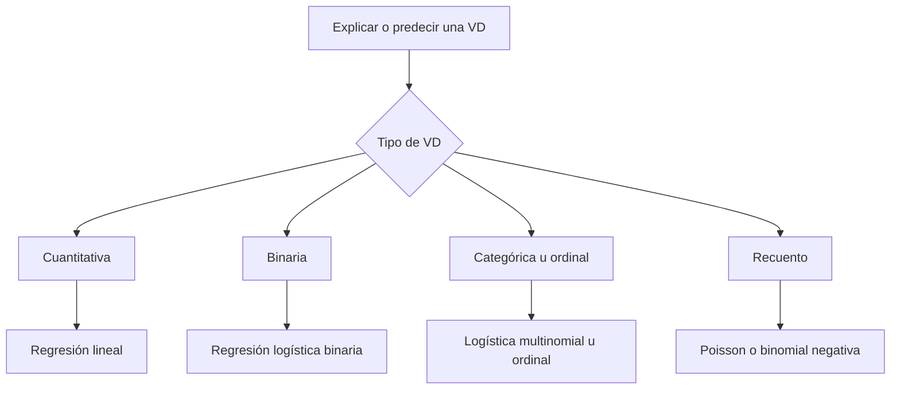

Si hay observaciones agrupadas o repetidas, se utilizan versiones mixtas o multinivel de estos modelos.

---

## 7. Verificación de las condiciones

La verificación no sustituye la selección según el plan experimental. Se realiza después de identificar la familia correcta de pruebas.

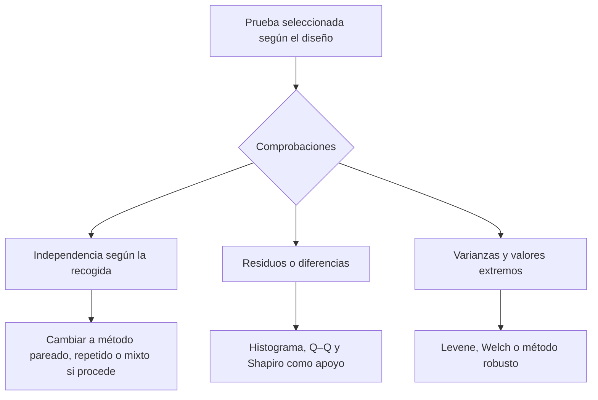

### Lo que debe comprobarse

1. **Independencia:** viene determinada por la recogida de datos.
2. **Normalidad:** se estudia principalmente en los residuos; para la t pareada, en las diferencias.
3. **Varianzas:** si son desiguales entre grupos independientes, se prefiere Welch.
4. **Valores extremos:** se investigan; no se eliminan solo para obtener significación.
5. **Tamaño y frecuencias:** en proporciones y tablas categóricas importan los recuentos esperados.

---

## 8. Después de una prueba global significativa

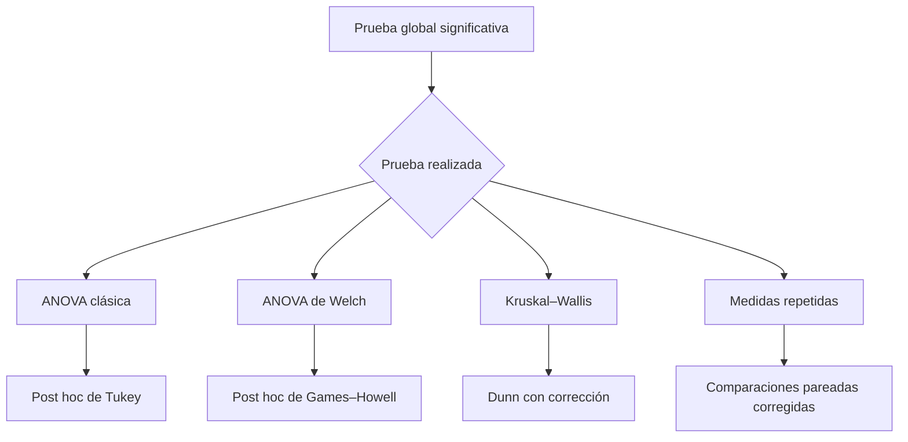

Una ANOVA significativa indica que existe al menos una diferencia, pero no identifica por sí sola qué grupos difieren. Las comparaciones múltiples deben corregirse, por ejemplo mediante Holm o Bonferroni.

---

## 9. Tabla maestra de selección

| VD | Objetivo y diseño | Prueba principal | Alternativa o extensión |
|---|---|---|---|
| Cuantitativa | una muestra frente a un valor | t de una muestra | Wilcoxon de una muestra |
| Cuantitativa | dos grupos independientes | t de Welch | Mann–Whitney |
| Cuantitativa | dos medidas relacionadas | t pareada | Wilcoxon |
| Cuantitativa | más de dos grupos independientes | ANOVA o ANOVA de Welch | Kruskal–Wallis |
| Cuantitativa | más de dos medidas relacionadas | ANOVA de medidas repetidas | Friedman |
| Cuantitativa | varias VI intersujetos | ANOVA factorial independiente | modelo lineal |
| Cuantitativa | varias VI intrasujetos | ANOVA factorial repetida | modelo lineal mixto |
| Cuantitativa | factores inter e intra | ANOVA mixta | modelo lineal mixto |
| Cuantitativa | covariable adicional | ANCOVA | regresión lineal |
| Varias VD cuantitativas | comparación simultánea | MANOVA | modelos separados corregidos |
| Binaria | una proporción frente a un valor | z de una proporción | binomial exacta |
| Binaria | dos proporciones independientes | z de dos proporciones o chi-cuadrado | Fisher exacta |
| Binaria | dos medidas relacionadas | McNemar | modelo logístico mixto |
| Binaria | más de dos medidas relacionadas | Q de Cochran | modelo logístico mixto |
| Categórica | asociación entre dos variables | chi-cuadrado | Fisher según la tabla |
| Ordinal | dos grupos independientes | Mann–Whitney | modelo ordinal |
| Ordinal | dos medidas relacionadas | Wilcoxon | modelo ordinal mixto |
| Ordinal | más de dos grupos independientes | Kruskal–Wallis | modelo ordinal |
| Ordinal | más de dos medidas relacionadas | Friedman | modelo ordinal mixto |
| Dos cuantitativas | asociación lineal | Pearson | regresión lineal |
| Ordinales o relación monótona | asociación | Spearman o Kendall | modelo ordinal |
| Recuento | explicación o predicción | regresión de Poisson | binomial negativa si hay sobredispersión |

---

## 10. Secuencia final que debe memorizarse

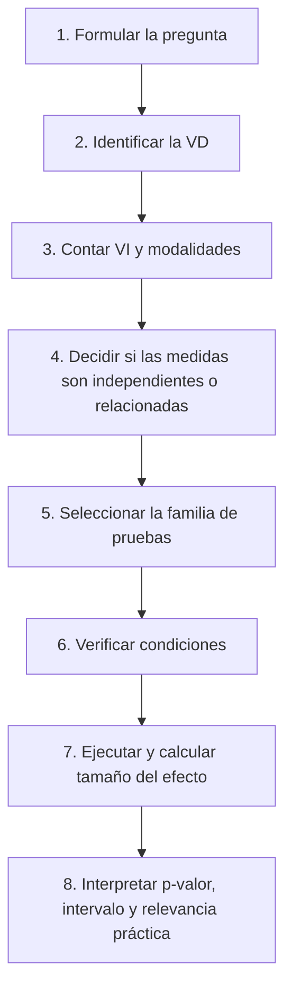

> La prueba correcta es la que corresponde a la pregunta, al tipo de variable y al plan de recogida; no la que produce el p-valor más pequeño.
